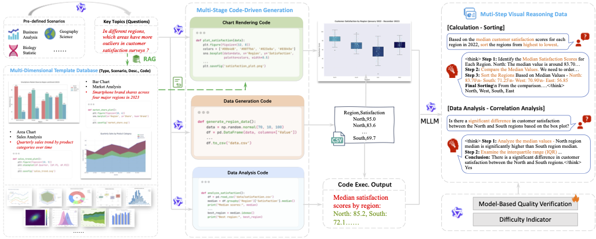
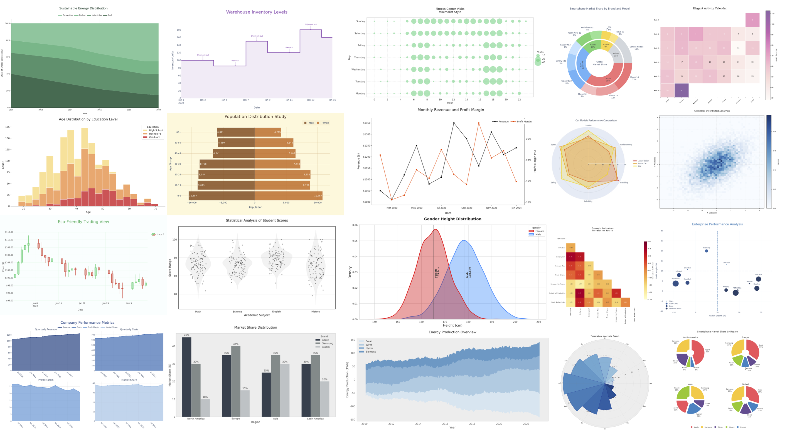

# ChartM³: Multi-Modal Multi-Step Chart Understanding

<p align="center">
  <a href="https://arxiv.org/abs/2511.02415"></a>
  <a href="https://creativecommons.org/licenses/by-nc-sa/4.0/"></a>
  <a href="https://www.python.org/downloads/"></a>
  <a href="https://aclanthology.org/2025.findings-emnlp.701/"></a>
</p>

<p align="center">
  <b>A Multi-Stage Code-Driven Pipeline for Constructing Multi-Dimensional and Multi-Step Visual Reasoning Data in Chart Comprehension</b>
</p>

<p align="center">
  <a href="#overview">Overview</a> •
  <a href="#installation">Installation</a> •
  <a href="#quick-start">Quick Start</a> •
  <a href="#pipeline">Pipeline</a> •
  <a href="#dataset">Dataset</a> •
  <a href="#citation">Citation</a>
</p>

---

## News

- **[2026.03]** Released Skill for chart synthesis pipeline
- **[2026.03]** Code released
- **[2025.09]** Paper accepted to EMNLP 2025!

## Overview

ChartM³ is an automated pipeline for generating chart understanding datasets to train vision-language models. It uses **code-driven generation** and CoT strategies to create diverse, high-quality chart visualizations and Q&A pairs.

### Key Features

- **63 Chart Types** × **60 Domains**: Comprehensive coverage of visualization scenarios
- **Multi-Step Pipeline**: Automated topic → data → chart → Q&A generation
- **Code-Driven Q&A**: Code-driven answer generation for numerical accuracy
- **Quality Control**: VLM-based chart and Q&A quality evaluation



## Installation

```bash
# Clone the repository
git clone https://github.com/aliyun/ChartM3.git
cd ChartM3

# Install dependencies
pip install -r requirements.txt

# Install package in development mode
pip install -e .
```

## Quick Start

### 1. Configure API Keys

Copy the default configuration and set your API keys:

```bash
cp configs/default.yaml configs/local.yaml
```

Edit `configs/local.yaml`:

```yaml
llm:
  api_key: "your-api-key"
  base_url: "https://api.openai.com/v1"
  model: ""

vlm:
  api_key: "your-vlm-api-key"
  base_url: "https://api.openai.com/v1"
  model: ""
```

Or set environment variables:

```bash
export CHARTM3_LLM_API_KEY="your-api-key"
export CHARTM3_VLM_API_KEY="your-vlm-api-key"
```

### 2. Run the Pipeline

Execute each step sequentially:

```bash
# Step 1: Generate topics and questions
python scripts/step1_generate_topics.py --config configs/local.yaml

# Step 2: Generate data
python scripts/step2_generate_data.py --config configs/local.yaml

# Step 3: Generate visualizations
python scripts/step3_generate_visualization.py --config configs/local.yaml

# Step 4: Generate Q&A pairs
python scripts/step4_generate_qa.py --config configs/local.yaml

# Step 5: Evaluate quality
python scripts/step5_evaluate_quality.py --config configs/local.yaml

# Step 6: Export dataset
python scripts/step6_export_dataset.py --config configs/local.yaml
```

## Pipeline

```
seed_field.json + chart_type.csv + data/database/
          │
          ▼ [Step 1: generate_topics]
    topics/{chart_type}_{domain}.json
          │
          ▼ [Step 2: generate_data]
    raw_data/{name}.json + {name}.csv
          │
          ▼ [Step 3: generate_visualization]
    visualizations/{name}/{name}.py + plot.png + {name}.csv
          │
          ▼ [Step 3.5: evaluate_chart_quality]
    visualizations/{name}/quality.json (quality markers)
          │
          ▼ [Step 4: generate_qa]
    qa_pairs/{name}_{task_id}.json
          │
          ▼ [Step 5: evaluate_quality]
    qa_pairs/{name}_{task_id}.json (with decision)
          │
          ▼ [Step 6: export_dataset]
    final/train.jsonl + test.jsonl
```

## Detailed Usage

### Step 1: Topic Generation

Generate business questions and chart topics.

```bash
# Minimal: Generate 4 topics for financial line charts
python scripts/step1_generate_topics.py --chart-type "折线图" --domain "金融" --max-topics 4 --workers 4

# Common Parameters
# --chart-type: Chart type (e.g., 折线图, 柱状图, 饼图)
# --domain: Domain (e.g., 金融, 医疗, 教育)
# --max-topics: Topics per combination (default: 20)
# --workers: Parallel workers
```

### Step 2: Data Generation

Generate CSV data files from topics.

```bash
# Minimal: Generate data for financial line charts
python scripts/step2_generate_data.py --chart-type "折线图" --workers 4

# Common Parameters
# --chart-type: Filter by chart type
# --max-topics: Limit topics to process
# --no-skip: Force regeneration of existing data
# --workers: Parallel workers
```

### Step 3: Visualization Generation

Render chart images from data.

```bash
# Minimal: Generate visualizations for financial line charts
python scripts/step3_generate_visualization.py --chart-type "折线图" --workers 4

# Common Parameters
# --chart-type: Filter by chart type
# --no-skip: Force regeneration of existing charts
# --workers: Parallel workers
```

### Step 3.5: Chart Quality Evaluation (Optional)

Evaluate visual quality of generated charts.

```bash
# Minimal: Evaluate line chart quality
python scripts/step3_5_evaluate_chart_quality.py --chart-types "折线图"

# Common Parameters
# --chart-types: Comma-separated chart types
# --mode: Evaluation mode (vlm/classifier, default: vlm)
# --classifier-path: Model path for classifier mode
# --workers: Parallel workers
```

### Step 4: Q&A Generation

Generate question-answer pairs for charts.

```bash
# Minimal: Generate visual and code_driven QA pairs
python scripts/step4_generate_qa.py --chart-type "折线图" --task-group visual code_driven --workers 4

# Common Parameters
# --chart-type: Filter by chart type
# --task-group: Task groups (visual/code_driven/subplot/extraction)
# --no-skip: Force regeneration
# --workers: Parallel workers
```

### Step 5: Quality Evaluation

Verify Q&A pair quality.

```bash
# Minimal: Verify QA quality for financial line charts
python scripts/step5_evaluate_quality.py --chart-type "折线图" --mode verification --workers 4

# Common Parameters
# --chart-type: Filter by chart type
# --mode: Evaluation mode (verification/comprehensive/relevance)
# --workers: Parallel workers
```

### Step 6: Dataset Export

Export to training format.

```bash
# Minimal: Export financial line charts to LLaVA format
python scripts/step6_export_dataset.py --chart-type "折线图" --format llava

# Common Parameters
# --chart-type: Filter by chart type
# --format: Output format (llava)
# --test-ratio: Test set ratio (default: 0.1)
# --no-explanation: Exclude explanatory answers
```

## Dataset

Using this framework, we construct **ChartM³ Dataset**:

| Split | Charts | Q&A Pairs |
|-------|--------|-----------|
| Training | 38,000+ | 142,000+ |
| Evaluation | 1,554 | 2,871 |

The dataset covers:
- **63 chart types** across categories: Basic, Statistical, Comparison, Relationship, Hierarchical, Time Series, Multi-chart
- **60 professional domains**: Finance, Healthcare, Technology, Education, Marketing, Environmental Science, and more





## Project Structure

```
ChartM3/
├── chartm3/                    # Main package
│   ├── config.py              # Configuration management
│   ├── llm/                   # LLM/VLM clients
│   ├── utils/                 # Utility functions
│   ├── prompts/               # Prompt templates
│   └── quality/               # Chart quality evaluation
├── scripts/                    # Execution scripts
│   ├── step1_generate_topics.py
│   ├── step2_generate_data.py
│   ├── step3_generate_visualization.py
│   ├── step3_5_evaluate_chart_quality.py
│   ├── step4_generate_qa.py
│   ├── step5_evaluate_quality.py
│   └── step6_export_dataset.py
├── data/
│   ├── database/              # Template database (63 chart templates)
│   │                          # Note: Due to data security requirements, only basic visualization code for each chart type is provided
│   ├── seed_field.json        # Domain definitions
│   └── chart_type.csv         # Chart type definitions
├── configs/                   # Configuration files
├── requirements.txt
├── setup.py
└── README.md
```


## Output Format

### LLaVA Format (train.jsonl)

```json
{
  "id": "chartm3_折线图_金融_0_basic_0",
  "image": "images/折线图_金融_0.png",
  "conversations": [
    {
      "from": "human",
      "value": "<image>\nWhat is the title of this chart?"
    },
    {
      "from": "gpt",
      "value": "The title of this chart is 'Stock Price Trends 2023'."
    }
  ],
  "metadata": {
    "task_type": "Title Identification",
    "question_type": "Fill-in-the-blank",
    "difficulty": "S",
    "chart_type": "折线图"
  }
}
```

## Citation

If you find this work useful, please cite our paper:

```bibtex
@inproceedings{xu-etal-2025-chartm3,
    title = "{C}hart{M}$^3$: A Multi-Stage Code-Driven Pipeline for Constructing Multi-Dimensional and Multi-Step Visual Reasoning Data in Chart Comprehension",
    author = "Xu, Duo  and
      Cheng, Hao  and
      Lin, Xin  and
      Xie, Zhen  and
      Wang, Hao Henry",
    booktitle = "Findings of the Association for Computational Linguistics: EMNLP 2025",
    month = nov,
    year = "2025",
    address = "Suzhou, China",
    publisher = "Association for Computational Linguistics",
    url = "https://aclanthology.org/2025.findings-emnlp.701/",
    doi = "10.18653/v1/2025.findings-emnlp.701",
    pages = "13046--13068",
}
```

## License

This project is licensed under the [CC BY-NC-SA 4.0](https://creativecommons.org/licenses/by-nc-sa/4.0/) License - see the [LICENSE](LICENSE) file for details. This project is intended for **academic research only** and shall not be used for any commercial purposes.


## Contact

For questions or issues, please open an issue on GitHub or contact the authors.
